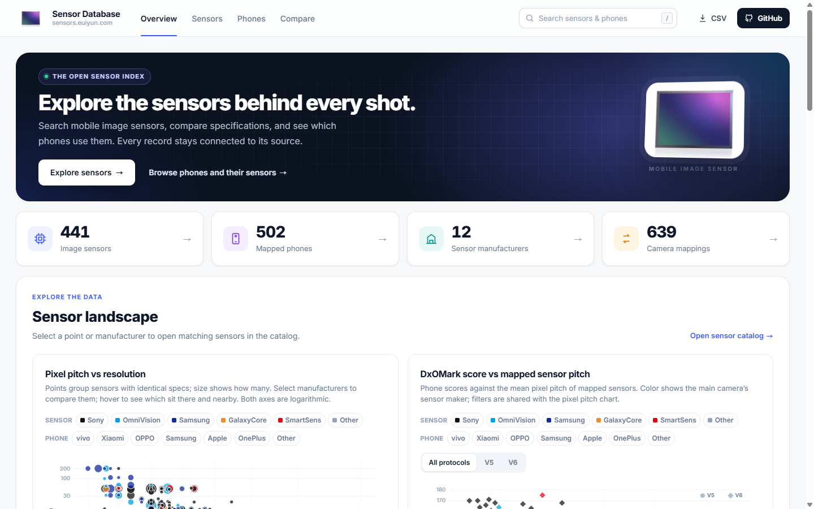
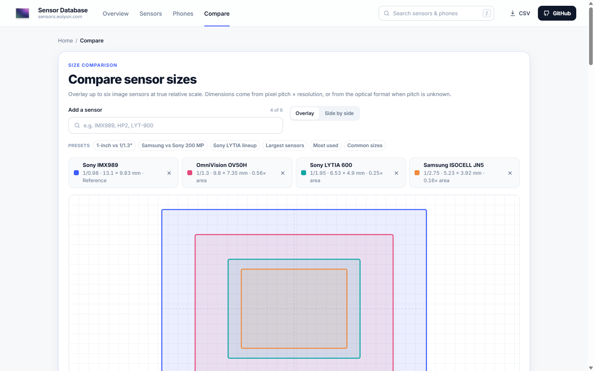

# Mobile Image Sensor Database

**[sensors.euiyun.com](https://sensors.euiyun.com/)**: an open, source-traceable catalog of smartphone camera sensors (Sony, Samsung ISOCELL, OmniVision, SmartSens, GalaxyCore and more), and of which phones use them.

[](https://sensors.euiyun.com/sensors/)
[](https://sensors.euiyun.com/phones/)
[](https://sensors.euiyun.com/data/all-in-one.csv)
[](https://creativecommons.org/licenses/by/4.0/)
[](https://github.com/geniuskey/sensors/actions/workflows/deploy.yml)



## What's inside

- **Trends**: pixel pitch vs resolution, main-camera sensor size over time, sensor-maker share.
- **[Sensor catalog](https://sensors.euiyun.com/sensors/)**: filter by maker, camera role, resolution and optical format; every spec links to its source.
- **[Phone catalog](https://sensors.euiyun.com/phones/)**: the sensor behind each camera (main, ultrawide, telephoto, selfie).
- **[Size comparison](https://sensors.euiyun.com/compare/)**: overlay up to six sensors at true physical scale, plus head-to-head pages such as [IMX989 vs LYT-900](https://sensors.euiyun.com/compare/sony-imx989-vs-sony-lytia-900-lyt-900-imx06a/).



## Open data & API

Free, no key. Details at [sensors.euiyun.com/open-data](https://sensors.euiyun.com/open-data/).

| | |
|---|---|
| CSV | [`/data/all-in-one.csv`](https://sensors.euiyun.com/data/all-in-one.csv) |
| JSON | [`/data/sensors.json`](https://sensors.euiyun.com/data/sensors.json), [`/data/phones.json`](https://sensors.euiyun.com/data/phones.json) |
| API | `GET /api/sensors?q=`, `GET /api/sensors/{id}`, `GET /api/phones?q=`, `GET /api/stats` |

```bash
curl "https://sensors.euiyun.com/api/sensors/SONY:IMX989"
```

This project's own work (catalog structure, normalized records, sensor-to-phone mappings, curation notes and exports) is licensed under [CC BY 4.0](https://creativecommons.org/licenses/by/4.0/); see [LICENSE.md](LICENSE.md). Individual facts are cited to their sources, and material owned by those sources is not relicensed. DXOMARK scores, prices and launch dates are DXOMARK's data and are **not copied** into this catalog. Only the tested device name and a link to its DXOMARK test page are kept. Please cite *Mobile Image Sensor Database, https://sensors.euiyun.com/*. Found a wrong spec or mapping? Use **Report a data error** on any sensor or phone page, or [open a correction](https://github.com/geniuskey/sensors/issues/new?template=data-correction.yml). Please include a source.

## Architecture

- **GitHub**: provenance, migrations, reviewed source changes, exports.
- **Cloudflare Pages**: static UI.
- **Pages**: `/` is the interactive data overview; `/sensors/` is the searchable and comparable sensor catalog; `/phones/` is the searchable phone catalog with per-camera sensor mappings. Detail pages live at `/sensors/<maker>/<product-id>/` and `/phones/<oem>/<model>/`. They are separate static pages with regular links between them.
- **Pages Functions**: read-only API.
- **Cloudflare D1**: production serving database.
- **Mac Studio / agents**: collectors, normalization, validation, PR creation.

The repository is deliberately reproducible: raw/import data -> normalized SQLite/D1 schema -> public CSV/JSON -> website.

## Bootstrap

```bash
npm install
npm run data:build
npm run build
```

This imports `data/raw/bootstrap_2026-09.csv` and merges the verified Helpix phone mappings in `exports/verified-mapping-additions-2026-09-26.csv`. It produces `database/local.sqlite3`, `database/seed.sql`, `public/data/sensors.json`, `public/data/phones.json`, and refreshed CSV exports.

To refresh DXOMARK test-page links from a saved `data/raw/dxomark smartphones.html` snapshot, first run `python scripts/import_dxomark.py`, then run `npm run data:build`. DXOMARK scores, prices and launch dates are DXOMARK's data and are **not copied** into this catalog. Only the tested device name and a link to its DXOMARK test page are kept.

## Cloudflare setup

```bash
npx wrangler login
npx wrangler d1 create sensors-db
cp wrangler.toml.example wrangler.toml
# put the returned database_id in wrangler.toml
npm run d1:migrate:remote
npm run d1:seed:remote
npm run deploy
```

Then add `sensors.euiyun.com` under the Pages project's **Custom domains**.

## Data policy

Never silently overwrite a disputed fact. Preserve source URLs, confidence, aliases and manual overrides. Official manufacturer sources outrank secondary catalogs for sensor specifications; adoption mappings may require third-party sources when OEMs do not publish sensor part numbers.

Read `docs/AGENT_GUIDE.md`, `docs/DATA_MODEL.md`, `docs/DATA_SOURCES.md`, and `docs/MAINTENANCE.md` before changing data pipelines.
